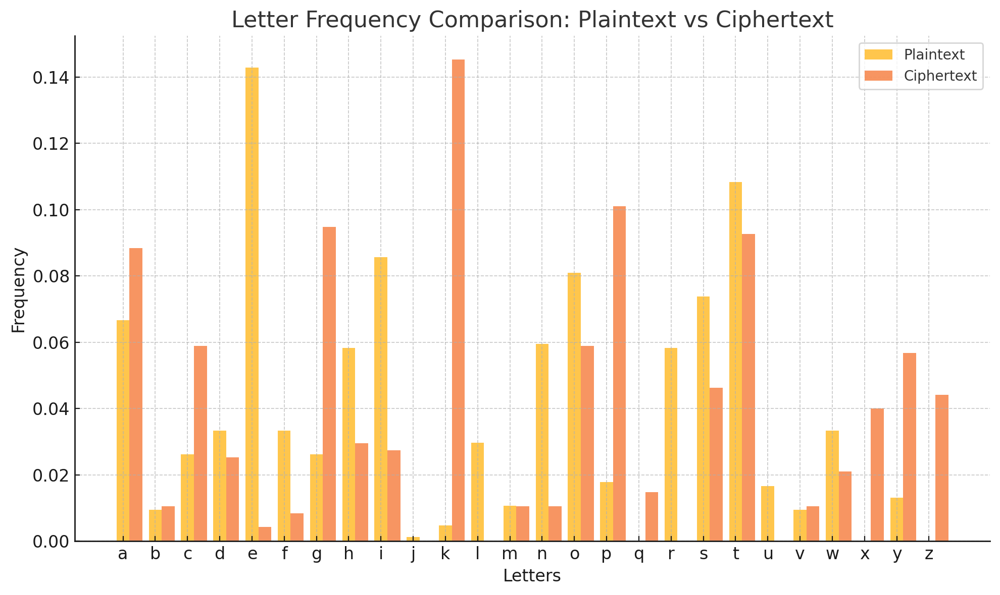
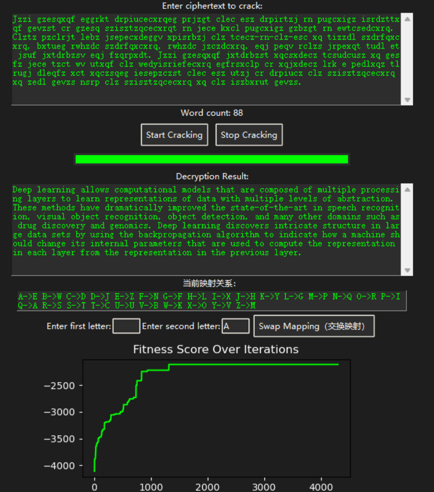
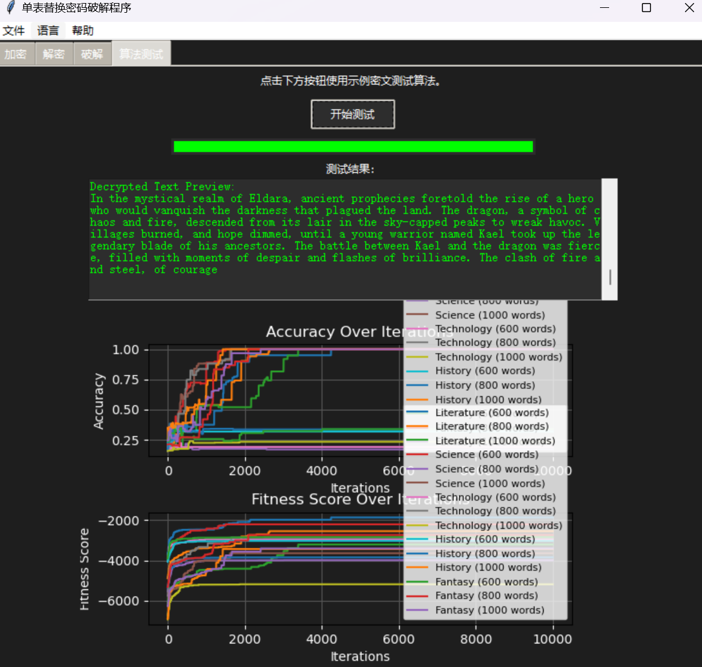

# SABCA - Simulated Annealing-Based Cipher Analysis
**SABCA** (Simulated Annealing-Based Cipher Analysis) is an advanced Python library designed for encrypting, decrypting, and cracking monoalphabetic substitution ciphers. It combines **probabilistic language models**, **linguistic syntax analysis**, and **optimization techniques** like **simulated annealing** to provide a robust and automated solution for substitution cipher analysis. 

SABCA is implemented with a **graphical user interface (GUI)** and **command-line interface (CLI)** to ensure usability for both beginners and advanced users.
## 🌟 Features
- **Automated Cipher Cracking**:  
  Break monoalphabetic substitution ciphers using simulated annealing and statistical methods.
- **Encryption/Decryption**:  
  Encrypt plaintext or decrypt ciphertext using user-provided or randomly generated keys.
- **Real-Time Visualization**:  
  GUI includes live charts for decryption progress and fitness score optimization.
- **Performance Across Text Types**:  
  Works effectively on both structured (e.g., literature) and unstructured (e.g., technical) text.
- **Fully Open-Source**:  
  The full implementation, including a GUI, is open-sourced for reproducibility and educational purposes.
## 📦 Installation
### Prerequisites
- Python 3.8 or higher  
- Libraries: `nltk`, `matplotlib`, `tkinter`

## 🚀 Latest Version: v1.4.1

The current version of **SABCA (v1.4.1)** is now available for download.  
You can access the program and all its resources from the following Google Drive link:

🔗 **[Download SABCA v1.4.1](https://drive.google.com/your-link-here)**

---

### What's New in v1.4.1
- Enhanced decryption accuracy with updated quadgram model.
- Optimized simulated annealing algorithm for faster convergence.
- Improved GUI with real-time progress updates and visualizations.
- Bug fixes and performance improvements.
- 
###  Select an option from the menu:
###     - Encrypt: Input plaintext and receive ciphertext with the key.
###     - Decrypt: Input ciphertext and a key to decrypt it.
###     - Crack: Automatically decrypt ciphertext without a key.
## 🔍 Experiment Details
### Objectives
1. Implement a monoalphabetic substitution cipher for encryption and decryption.
2. Demonstrate statistical vulnerabilities using letter frequency analysis.
3. Develop an automated cracking method using simulated annealing.
### Key Insights
- **Encryption and Decryption**: Successfully implemented a substitution mapping system for consistent encryption-decryption workflows.
- **Statistical Analysis**: Visualized plaintext and ciphertext letter frequency distributions to reveal encryption patterns and vulnerabilities.
- **Simulated Annealing Optimization**: Balanced computational efficiency and decryption accuracy using probabilistic language models and iterative refinement of mappings.
- 
## 📊 Experimental Results

### Visualization of Frequencies
The following figure compares the frequency distributions of letters in plaintext and ciphertext:

<div style="text-align: center;">
  
</div>

### Simulated Annealing Progression
The figure below shows the evolution of decryption accuracy and fitness score over iterations:

<div style="text-align: center;">
  
</div>

### GUI Demonstration
The GUI provides real-time feedback on decryption progress and accuracy:

<div style="text-align: center;">
  
</div>

## 💖 Support Us

Help us continue improving **SABCA**! You can:

1. **Star the Repository**:  
   Show your support by starring the GitHub repository.

2. **Contribute**:  
   Submit issues or pull requests to help improve the project.

3. **Donate**:  
   Support the project by donating to the QR codes below:

<table>
  <tr>
    <td style="text-align: center;">
      <p>WeChat</p>
      
    </td>
    <td style="text-align: center;">
      <p>Alipay</p>
      
    </td>
  </tr>
</table>


## 📜 Citation

If you use **SABCA** in your research, please cite:
  ```bibtex
     @misc{sabca2024,
           author = {Ziheng Wang},
           title = {SABCA: Simulated Annealing-Based Cipher Analysis},
           year = {2024},
           howpublished = {GitHub Repository},
           url = {https://github.com/Nickory/SABCA---Simulated-Annealing-Based-Cipher-Analysis} }

```


## 🔗 Links
- [GitHub Repository](https://github.com/Nickory/SABCA---Simulated-Annealing-Based-Cipher-Analysis)
- [Documentation](https://github.com/Nickory/SABCA---Simulated-Annealing-Based-Cipher-Analysis/wiki)

